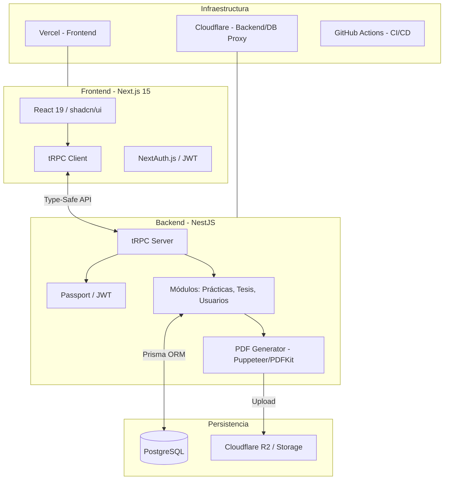
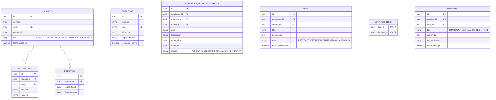

# Arquitectura del Sistema - UNT Gestión de Prácticas y Tesis

## Diagrama de Arquitectura

```mermaid
graph TD
    subgraph Cliente [Frontend - Next.js 15]
        UI[React 19 / shadcn/ui]
        TRPC_C[tRPC Client]
        Auth_C[NextAuth.js / JWT]
        UI --> TRPC_C
    end

    subgraph Servidor [Backend - NestJS]
        TRPC_S[tRPC Server]
        Auth_S[Passport / JWT]
        Logic[Módulos: Prácticas, Tesis, Usuarios]
        Reports[PDF Generator - Puppeteer/PDFKit]
        TRPC_S --> Auth_S
        TRPC_S --> Logic
        Logic --> Reports
    end

    subgraph Datos [Persistencia]
        DB[(PostgreSQL)]
        S3[Cloudflare R2 / Storage]
    end

    TRPC_C <-->|Type-Safe API| TRPC_S
    Logic <-->|Prisma ORM| DB
    Reports -->|Upload| S3
    
    subgraph Infraestructura
        Vercel[Vercel - Frontend]
        Cloudflare[Cloudflare - Backend/DB Proxy]
        GA[GitHub Actions - CI/CD]
    end
    
    Vercel --- Cliente
    Cloudflare --- Servidor
```

## Modelo de Datos (ER)

```mermaid
erDiagram
    USUARIOS ||--o| ESTUDIANTES : "es un"
    USUARIOS ||--o| DOCENTES : "es un"
    USUARIOS {
        uuid id PK
        string nombre
        string email UK
        string password
        string rol "ADMIN, COORDINADOR, ASESOR, ESTUDIANTE, EMPRESA"
        datetime fecha_creacion
    }

    ESTUDIANTES {
        uuid id PK
        uuid usuario_id FK
        string codigo UK
        string facultad
        string escuela
    }

    DOCENTES {
        uuid id PK
        uuid usuario_id FK
        string especialidad
        string departamento
    }

    EMPRESAS {
        uuid id PK
        string nombre
        string ruc UK
        string direccion
        string representante
        boolean convenio_activo
    }

    PRACTICAS_PREPROFESIONALES {
        uuid id PK
        uuid estudiante_id FK
        uuid empresa_id FK
        uuid asesor_id FK
        string titulo
        string descripcion
        date fecha_inicio
        date fecha_fin
        string estado "PENDIENTE, EN_CURSO, FINALIZADA, REPROBADA"
    }

    TESIS {
        uuid id PK
        uuid estudiante_id FK
        uuid asesor_id FK
        string titulo
        text descripcion
        string estado "PROYECTO, EJECUCION, SUSTENTACION, APROBADA"
        datetime fecha_sustentacion
    }

    JURADOS_TESIS {
        uuid tesis_id PK, FK
        uuid docente_id PK, FK
    }

    INFORMES {
        uuid id PK
        uuid practica_id FK
        uuid tesis_id FK
        string tipo "PRACTICA, TESIS_AVANCE, TESIS_FINAL"
        text contenido
        string url_documento
        datetime fecha_entrega
    }
```
